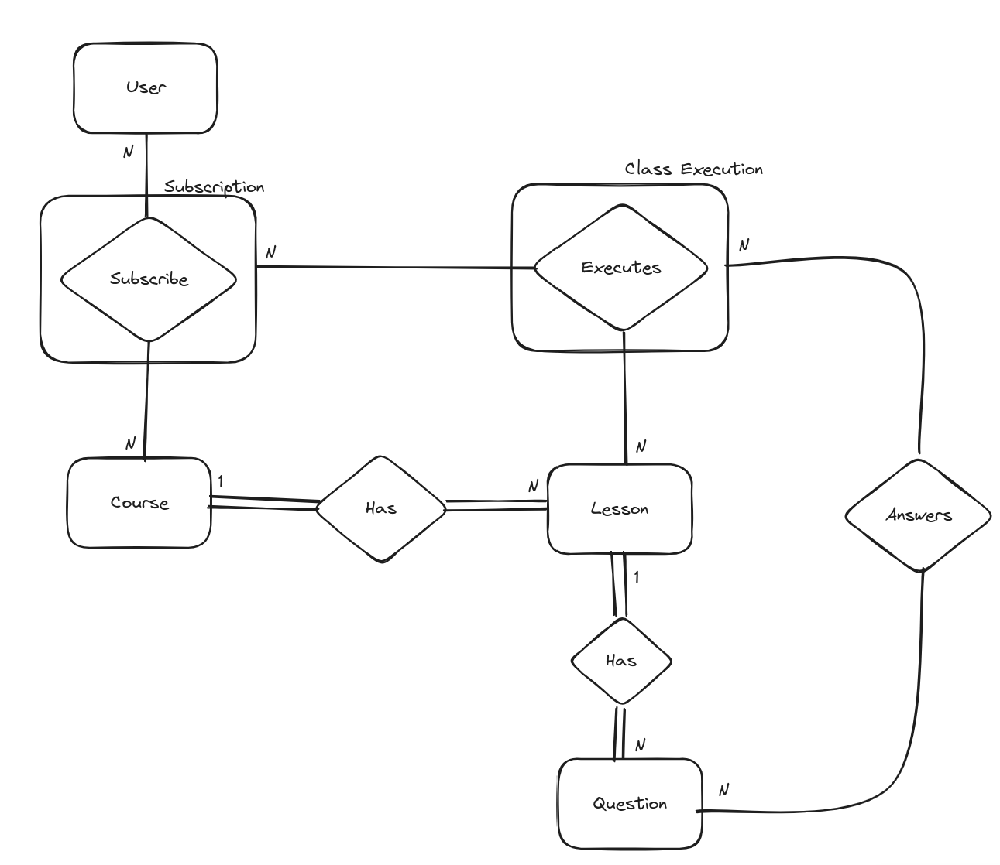
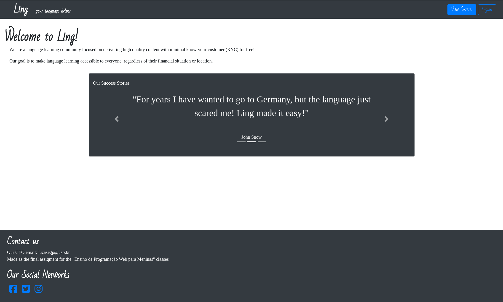
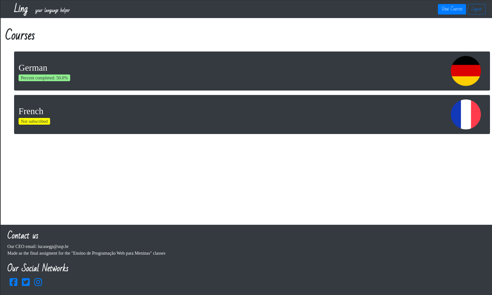
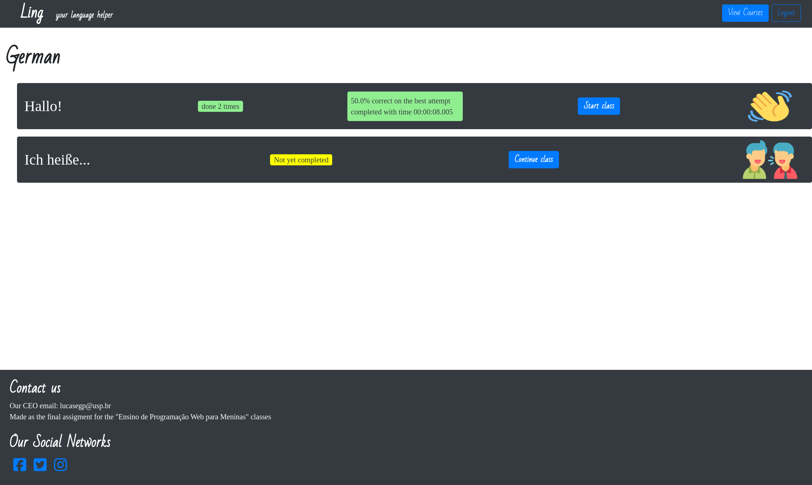

# Ling
Ling is a simple project to demonstrate django and its capabilities. It implements a simple CRUD application that simulates a language learning platform, complete with:
- the capability to add courses, lessons and questions (that are presented in a random order and from a pool of possible questions, not just hard coded) via the /admin path
- a login and register endpoints
- views of percentage of course completion, as well as best lesson attempt for each lesson in a course
- a javascript enabled interactive question - answering for lesson executions
- capacity to stop lessons and continue doing them afterwards

The main strenght of the project lies on the fact that the object relational mapping is very robust, and without any kind of denormalization necessary we can present complex statistics. Also, note that more details than available to the user are stored in the database, such as all executions of a certain class, including start and end date.

There is a sample list of lessons and questions to demonstrate the app available in the db.sqlite3 file and the static/ directory, as well as a default superuser, with login "root" and password "root".

The Object Relational Model for the application's database is given below (does not include properties, just for a high level overview):

Some of the application's screens:

